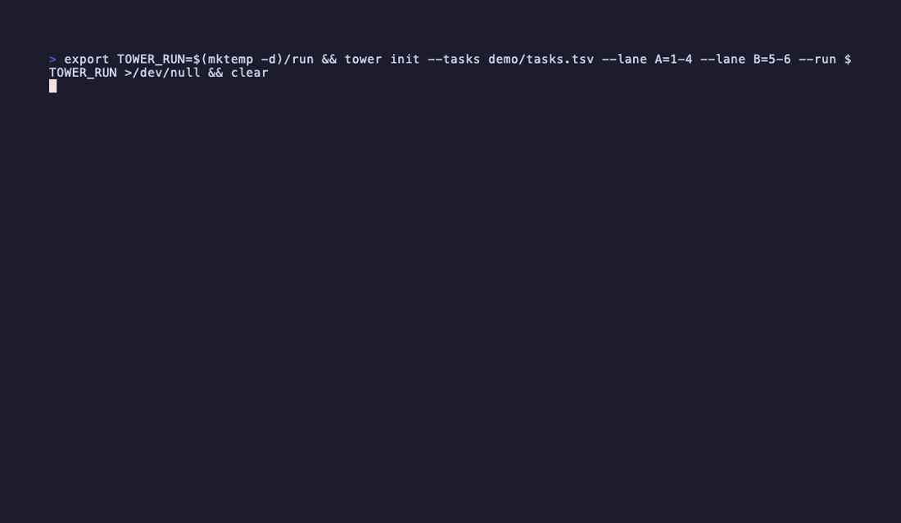

# tower

A control tower for long-running agent implementation runs.



You hand a multi-task plan to two or three coding-agent lanes and they work for
hours. `tower` is the pane you leave open: which task each lane is on, what
phase it is in, which model is flying it, what landed, what is stuck — from an
append-only log the agents write to with one command.

tower's first run was its own build.

## What it is not

tower starts nothing, reads no agent's screen, sends nothing to an agent, and
has no opinion about what should happen next. It observes. Kill it mid-run and
the run continues; you just go blind. That is the design: it is the one
component you can leave running for six hours without worrying about it.

## Install

```sh
npm install -g @phutschi/tower      # Node ≥ 22 or Bun
```

> Not on npm yet — publishing is pending. Until then, use a release binary,
> or clone and run `bun run dev`.

Or download a standalone binary for macOS or Linux from the
[releases](https://github.com/phutschi/tower/releases) — no runtime needed.

## Sixty seconds

```sh
# 1. From your repository, create a run from a plan.
tower init --plan docs/plans/widgets.md --lane A=1-6 --lane B=7-9

# 2. Print the letter each lane's agent gets. Paste it into the agent.
tower brief A

# 3. Leave this open.
tower
```

Your agents report with three commands (the brief teaches them; tower refuses a
malformed report and prints the correct form, so they self-correct):

```sh
tower task 4 in_progress implementing --model sonnet-5
tower task 4 reviewing spec-review --model sonnet
tower task 4 done committed "feat: the gate" --model sonnet-5
tower block 7 "needs the test database created"
tower note --lane B "merged lane A at task 4"
```

Scripts ask tower instead of polling:

```sh
tower state --json           # the folded state; literal, versioned
tower wait --timeout 300     # exit 0 with the reasons on attention, completion, or close; 3 when quiet
```

## The screen

```
 TOWER ─────────────────────────── ACME · feature/widgets

 INFORMATION CHARLIE · 21:47 · 2h35m since first departure
 ███████████████████▒▒▒▒▒▒▒  12 of 21 landed · 1 airborne · 1 holding short

 RUNWAY A  ▸ 14  sonnet-5        RUNWAY B  ⚠ 12

 DEPARTURES
  ✓ 11 landed  (1 … 11)
  ✓ 13      The surface hint              B   opus            a91c2f0
  ▸ 14      The onDirectMessage handler   A   sonnet-5        34m · go around · NORDO 12m
  ⚠ 12      Voice notes                   B   holding short: needs the test DB
  ○ 15      notifyTelegram                A
  … 6 more on the ground

 TRANSCRIPT
  21:33:02  ACME 12   squawk 7700 · needs the test DB created
  21:35:02  ACME 14   go around · spec review: missing null guard
  21:40:11  RUNWAY A  merged lane B at task 8

 [q] close the tower
```

The vocabulary is air traffic control because the pipeline genuinely is a
flight: a task departs, is reviewed on approach, and either bounces (_go
around_) or lands. A task nobody has heard from is _NORDO_. Prefer plain words?
`tower --plain`. Prefer a different domain? See [themes](docs/themes.md).

## How it works

```
<run dir>/
  run.json        identity, written once by `tower init`
  events.ndjson   append-only; one JSON line per report
```

Every report is a single `O_APPEND` write, so lanes in different worktrees can
report in the same millisecond without a lock and without losing a line. State
is a pure fold of the log: kill tower, restart it, read a finished run a week
later — nothing is lost. The event line and `tower state --json` are versioned
public contracts; see [docs/protocol.md](docs/protocol.md).

tower finds its run through `--run`, then `$TOWER_RUN`, then a pointer file in
the repository's common git directory — so every worktree of a repository lands
on the same run without being told where it is.

## Works with

tower knows nothing about how you run agents. The executor brief is plain
text; the [orchestrator skill](skills/run/SKILL.md) is in the open Agent
Skills format, which Claude Code, Codex, Cursor, Gemini CLI and others can
load. Exercised so far with Claude Code. Recipes for running lanes with
[herdr](docs/recipes/herdr.md) and with [tmux](docs/recipes/tmux.md).

Claude Code users can install the skill directly:

```
/plugin marketplace add phutschi/tower
/plugin install tower@phutschi-tower
```

then `/tower:run`.

## Commands

|                                                       |                                                                    |
| ----------------------------------------------------- | ------------------------------------------------------------------ |
| `tower`                                               | the console (`--plain`, `--theme`, `--stale <min>`, `--run <dir>`) |
| `tower init`                                          | create a run from `--plan <md>`, `--tasks <tsv>` or stdin          |
| `tower assign <lane> <ids>`                           | record which tasks a lane owns                                     |
| `tower brief <lane>`                                  | the executor letter                                                |
| `tower close [note]`                                  | declare the run finished                                           |
| `tower task <id> <status> [phase] [note] --model <m>` | report                                                             |
| `tower block <id> "<need>"`                           | report blocked                                                     |
| `tower note [--task\|--lane] "<text>"`                | narrate                                                            |
| `tower state --json`                                  | the folded state                                                   |
| `tower wait --timeout <s>`                            | block until attention                                              |
| `tower theme rules\|new\|check\|preview`              | author a theme                                                     |

`tower --help` for the flags.

## Platforms

macOS and Linux on local filesystems. Windows is not supported (WSL works).
Network filesystems are not supported: the append atomicity tower relies on
does not hold on NFS.

No telemetry, no update checks. `NO_COLOR` is respected.

## License

MIT © Philipp Wruck
