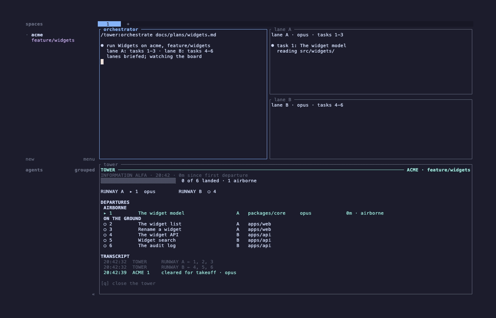

# tower

tower runs a coding plan with several coding agents at once, and keeps the
record of the run on one board. You watch one screen instead of four
terminals.



## How a run goes

The plan is split into lanes: groups of tasks, each worked in order by one
agent, the lane's executor. The orchestrator is another agent; it never
implements.

1. Write a spec: what to build, as an issue or a file.
2. `/tower:spec-to-plan <spec>` slices it into tasks, groups them into lanes
   with their merge points, and writes `plan.md`. It writes no code.
3. `/tower:orchestrate <plan.md>`, from a pane in [herdr](https://herdr.dev)
   (a terminal for running coding agents side by side), opens the run. Each
   lane, up to four (A to D), gets an executor: Claude Code, Codex or Cursor
   (`cursor-agent`). Lane A works in your checkout, lanes B to D each in a
   worktree. The executors implement and report each task to tower.
4. A Reviewer, a fresh agent that wrote none of the lane, reviews each
   finished lane; the orchestrator merges it. Preflight, a last review of the
   whole branch, follows. You triage its findings in one table, and a draft PR
   opens.

With no plan, `/tower:orchestrate` alone opens the run, and you say what to
build. Either way, the record of the run is tower's board and transcript.

## What you see

The console shows the board, every task with its lane, status, phase and
model, and the run's transcript below it. You leave it open for hours. It is
read-only: it starts nothing and sends nothing, so closing it only makes you
blind; the run goes on. The demo above is a scripted run, from the first task
to the close. `NO_COLOR` is respected.

## Without herdr

`/tower:run` is a lighter orchestrator that needs no herdr. You start the
executor sessions yourself, in whatever tool you use; it briefs them, watches,
and closes the run. It does not review, merge or open a PR. The skills use the
open Agent Skills format. They are tested with Claude Code, and
`/tower:orchestrate` can also run Codex and Cursor lanes.
[docs/orchestrate.md](docs/orchestrate.md) covers the user contract (your run
defaults for every repo) and the opt-in credit guard.

Or use the CLI on its own: `tower init` from a plan, `tower brief` for each
executor, `tower` to watch. Executors report with `tower task`, `tower block`
and `tower note`. See [docs/cli.md](docs/cli.md).

## Install

tower has two parts: the CLI and the skills. Install the CLI one of three
ways, then the skills. You never need Bun to use tower.

**A release binary** (macOS and Linux, arm64 or x64, no runtime needed). Each
release carries `tower-<os>-<arch>` and a `SHA256SUMS` to check it against;
take v0.4.0 or the latest. Set `bin` to yours (`tower-darwin-arm64`,
`tower-darwin-x64`, `tower-linux-x64` or `tower-linux-arm64`); the binary is
installed only if its checksum matches:

```sh
v=v0.4.0; bin=tower-darwin-arm64
curl -fLO https://github.com/phutschi/tower/releases/download/$v/$bin
curl -fLO https://github.com/phutschi/tower/releases/download/$v/SHA256SUMS
shasum -a 256 -c --ignore-missing SHA256SUMS &&
  mkdir -p ~/.local/bin && install -m 755 "$bin" ~/.local/bin/tower
```

On Linux, check with `sha256sum -c --ignore-missing SHA256SUMS` instead. Put
`~/.local/bin` on your `PATH` if it is not.

**From a clone** (`git clone https://github.com/phutschi/tower`),
`./install.sh` fetches and checks the release binary when tower is missing,
installs the plugin, and links the skills for Codex. It needs herdr, git,
python3 and node, and stops if one is missing.

**From git**, with Node ≥ 22.12 and nothing else:

```sh
npm install -g github:phutschi/tower
```

tower is not on the npm registry yet.

**The skills** ship as a plugin for Claude Code and Cursor:

```text
/plugin marketplace add phutschi/tower
/plugin install tower@phutschi-tower
```

In Cursor: **Settings → Plugins → Add marketplace from GitHub** →
`phutschi/tower`, then enable **tower** (Cursor reads `.cursor-plugin/`; a
clone's `./install.sh` also links the kit into `~/.agents/skills` for Codex and
cursor lanes).

## Docs

- [docs/orchestrate.md](docs/orchestrate.md): a run in herdr, step by step,
  and the switches.
- [docs/cli.md](docs/cli.md): the commands, the screen, how the record works.
- [docs/agents.md](docs/agents.md): pointing your agents at tower.
- [docs/plan-format.md](docs/plan-format.md),
  [docs/protocol.md](docs/protocol.md), [docs/themes.md](docs/themes.md),
  [docs/recipes/](docs/recipes/), and the decisions in
  [docs/adr/](docs/adr/).
- [CONTEXT.md](CONTEXT.md): the words tower uses.

## Contributing

Start with [CONTRIBUTING.md](CONTRIBUTING.md); agents working on tower read
[AGENTS.md](AGENTS.md). You need Bun for the CLI, and shellcheck for the kit.
`bun run check`, `./test.sh` and shellcheck are what CI runs. Every change goes
through a pull request, never straight to `main`.

## License

MIT © Philipp Wruck
